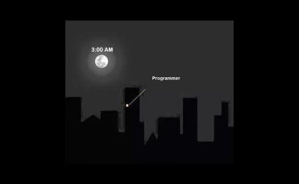

# Python 

This repository contains student exercise files from the Python section of the Infrastructure as Code module on the Postgraduate Diploma in Cloud Computing.  No prior knowledge of programming or Python language was assumed for the completion of this course. The lecturer provided weekly technical walkthroughs containing Python theory, code examples and exercises to complete. The exercise folders in this repository contain a mixture of typed code samples and completed exercises. 

### Requirements 

- Python 3.10.7 (64-bit) installed.
- Editor to run the code, such as Notepad ++ or Visual Studio Code. 

### Content

**Exercise_01** - Focused on learning the basics of Python language, variables, data types, operators (arithmetic, comparison, logical and Boolean), precedence and string manipulation. 

**Exercise_02** - "Code is more often read than written " (Guido van Rossum).  Students were taught the importance of adding comments to code and documenting its use and functionality. 

**Exercise_03** -  Data structures provide a means of organising data so it can be accessed efficiently, and students were shown how to use Python lists, tuples, dictionaries and sets. 

**Exercise_04** -  Students were introduced to the basic types of control structures, sequential, selection and repetition, using if statements and loops. 

**Exercise_05** - Introduced the writing of functions (blocks of code run when it is called), looking at function anatomy, passing of values, hints, scope, and map and lambda functions specific to Python.

**Exercise_06** - Covered the topic of Python modules and packages, with a module being a Python file containing a function, and a package a directory containing a collection of modules.

**Exercise_07** - “The greatest mistake is to imagine that we never err.” (Thomas Carlyle). Students were shown how to handle errors using try and except keywords, input validation and raising exceptions.  

**Exercise_08** - Covered the more advanced topic of Object Oriented (OO) coding in Python, which organises code around objects which encapsulate data, attributes and methods. 

**Exercise_09** - The importance of testing to ensure that code is working as expected was the subject of this exercise with Python Pylint and Unit tests created.

**Exercise_10** - Students were shown how to use standard libraries to handle time and logging. 

**Exercise_11** - Python and network protocols were used in the exercise to communicate and transfer files using protocols such as FTP, TCP, UDP, and Multicast.

**Exercise_12** - Students were shown how to create a folder structure for a programming project in the final exercise.

**GitHub**

Students also learnt how to use Git and GitHub as part of the Infrastructure as Code module. For practice, they were required to create this repository to store their Python exercise files, creating a branching structure with a feature branch to test their knowledge and skills.  The readme.md file was created through this feature branch.

### Project Status

All the walkthroughs were completed successfully, with all sample code typed and exercises completed. Having mastered the basics, the recommended route to becoming an accomplished Python programmer is to code, code,  code. 

### Other Courses

Check out the  [PowerShell](https://github.com/L00177769/PowerShell.git) course also from the Infrastructure as Code Module.

### Author

Student: L00177769 Date: 27/12/2022
